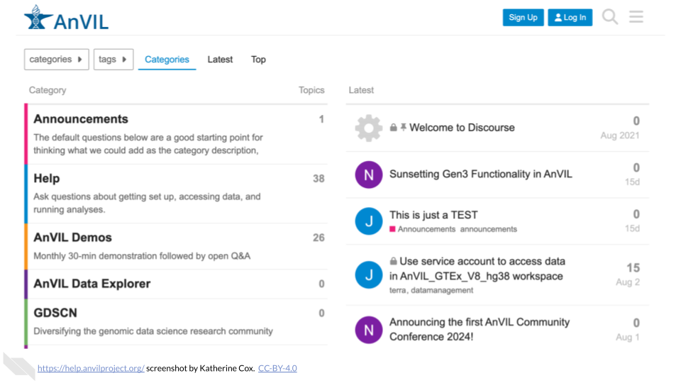

# Get Help {#help}

As an AnVIL Champion, your job is *not* to answer every question about AnVIL. You can help people find answers to their specific questions by directing them towards existing channels for receiving help on AnVIL.

If people have questions, there are a few places they can go to get help:

- [AnVIL Support Forum](https://help.anvilproject.org): The AnVIL Support forum is always available, and the AnVIL team regularly monitors the support forum and responds to questions. By posting in the support forum, other AnVIL users can also benefit from the questions and responses.
- [AnVIL Demos](https://help.anvilproject.org/c/demos/): ~Monthly 30-min Zoom demonstration followed by open Q&A provides an opportunity for live interactions with members of the AnVIL team.
